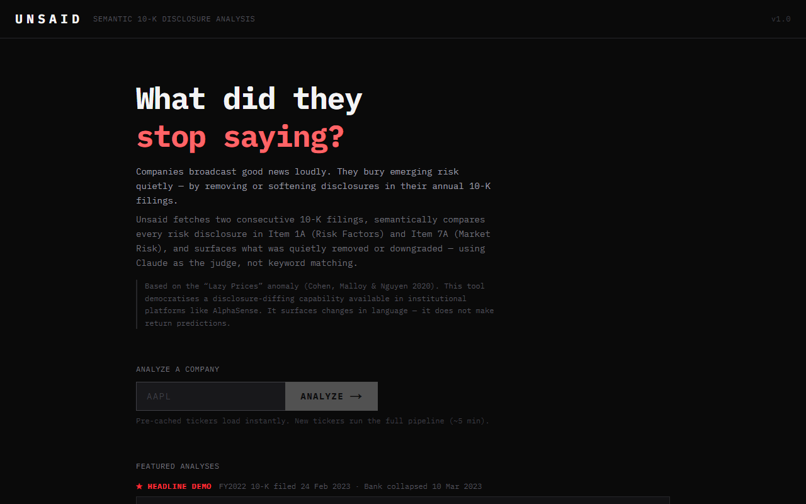
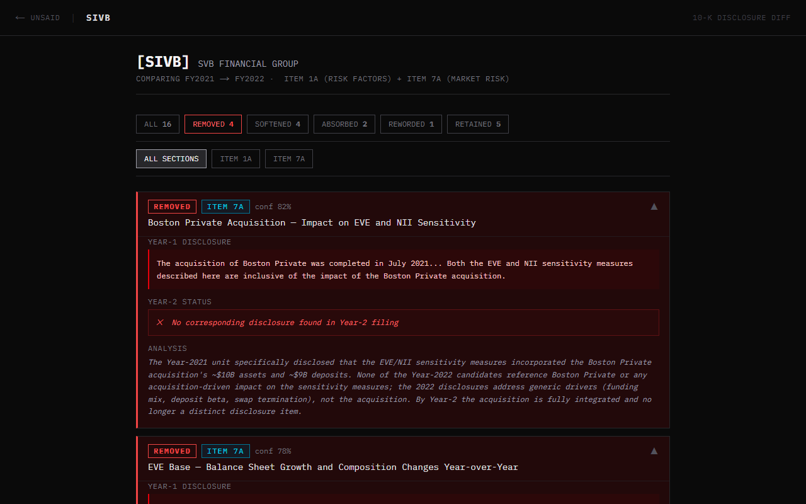

# Unsaid
### Semantic 10-K Disclosure-Removal Detector


> Companies announce good news loudly, while they bury bad news quietly by removing or softening language in their annual SEC filings. Unsaid surfaces what they stopped saying.

---





---

## The problem

Every year, public companies file a 10-K with the SEC. Most of the attention goes to the numbers. Almost none goes to *what language disappeared* between one year and the next.

Academic research (Cohen, Malloy & Nguyen 2020 — "Lazy Prices") shows that ~86% of year-over-year textual changes in 10-Ks are negative in sentiment, and that markets systematically underprice them. Institutional platforms like AlphaSense and Verity charge enterprise rates to detect these changes. No free, open, *semantic* version exists.

Unsaid is that tool.

It fetches two consecutive 10-K filings from SEC EDGAR, semantically compares every risk disclosure in Item 1A (Risk Factors) and Item 7A (Market Risk), and classifies each Year-1 disclosure as **REMOVED**, **SOFTENED**, **REWORDED**, **RETAINED**, or **ABSORBED** — using Claude as the judge, not keyword matching.

---

## The demo — Silicon Valley Bank

SVB filed their FY2022 10-K on **24 February 2023**. The bank collapsed on **10 March 2023** — 14 days later.

Running Unsaid on the real EDGAR filings reveals what was quietly removed from Item 7A (Market Risk Disclosures):

```
[REMOVED] [Item 7A]  EVE Hedging — Interest Rate Swaps and Sensitivity Reduction
  confidence: 0.86

  Year-1 (FY2021):
  "In March 2021 we purchased interest rate swaps to offset some of the additional
  EVE sensitivity... The addition of pay fixed swaps reduces this exposure to
  -13.9 percent in the same scenario."

  Year-2 (FY2022): No corresponding disclosure found.

  Reasoning: The Year-1 disclosure described an active EVE hedge using pay fixed
  swaps that reduced rate-shock sensitivity. Year-2 explicitly states the pay fixed
  swaps portfolio was terminated, with no replacement hedging disclosed.

──────────────────────────────────────────────────────────────────────────────

[SOFTENED] [Item 7A]  EVE and NII Sensitivity Table — Rate Shock Scenarios
  confidence: 0.72

  Year-1 (FY2021):
  "December 31, 2021: +200bps → EVE $(5,722)M  (27.7)%  |  NII $981M  22.9%"

  Year-2 (FY2022): EVE column removed entirely. Only NII sensitivity shown.

  Reasoning: The FY2022 table drops the EVE sensitivity disclosure entirely —
  no longer quantifying the -27.7% / -$5.7bn EVE decline on a +200bp rate move.
  The same interest-rate risk persists but the EVE dimension is no longer disclosed.
```

This is not hand-coded. It is the raw output of the pipeline run against the actual SEC filings.

> **Provenance.** This cached analysis predates the pipeline's provenance tracking. It covers **Item 7A only** — Item 1A extraction failed on this filing at the time — and was aligned with TF-IDF rather than dense embeddings. The findings are real and checkable against the filings themselves; the run that produced them is not reproducible under the current pipeline. See [`NOTES.md`](NOTES.md).

---

## What Unsaid does

Given a company ticker and two fiscal years, Unsaid:

1. **Auto-Discovers Filings**: Queries SEC EDGAR in real-time to list all available 10-K fiscal years.
2. **Extracts Prose & Tables**: Extracts Item 1A (Risk Factors) and Item 7A (Market Risk) while preserving quantitative sensitivity matrices.
3. **Segments Disclosures**: Splits monolithic sections into discrete, self-contained risk units via Claude Sonnet.
4. **Aligns Semantically**: Uses `all-mpnet-base-v2` dense vector embeddings to compute candidate pairings and detect new disclosures.
5. **LLM Judgment**: Claude Opus evaluates economic risk shifts: **REMOVED**, **SOFTENED**, **NEW**, **ABSORBED**, **REWORDED**, or **RETAINED**.
6. **Caches & Streams Progress**: Live progress with multi-stage progress tracking and execution console logs; caches results to disk for zero-latency review.
7. **Exports & Shares**: One-click export to CSV spreadsheet, Markdown executive memo, or raw JSON.

---

## Research: does it actually predict returns?

Unsaid was tested against its own premise, on the
[`research/banking-study`](../../tree/research/banking-study) branch: the pipeline
across **57 US banks and 321 consecutive 10-K pairs** (FY2019–2025), scoring each
pair by disclosure change and measuring forward returns against the KRE
regional-banking index.

**The signal failed three independent ways.**

| | |
|---|---|
| multiplicity | family-wise `p = 0.131` across 24 specifications |
| out of sample | pre-registered test on a held-out year reversed sign, `−4.95%` |
| measurement | `+7.98% (t=2.48)` → `+6.15% (t=1.83)` once text extraction was fixed |

The third is the most telling: an effect that shrinks as measurement error is
removed is behaving like measurement error.

Two caveats stated plainly, because they cut both ways. The point estimate's
*magnitude* does land inside the range Cohen et al. report (4–7%/yr
value-weighted), so this is a study that was underpowered rather than one
measuring something unrelated. And 57 banks that nearly all file in February are
roughly **six independent bets**, not 321 — so this is not a refutation of a paper
drawn from thousands of firms across every sector.

A **bag-of-words baseline** — the term-frequency similarity Cohen et al. actually
use — outperformed the LLM classifier on every cut.

📉 **[Full write-up, with the instrument defects →](https://claude.ai/code/artifact/631c8c2a-ea3f-4c9e-bd01-93e45928fde5)**

The tool's value does not depend on the anomaly replicating in 57 banks over six
years. *Show me what this company stopped saying* stands on its own. But the study
is the honest test of the stronger claim, and it is kept in full — code, corpus and
null — rather than quietly dropped.

---

## Tool Capabilities & Features

- **Interactive Research Terminal**: Look up any public company ticker (e.g. `NVDA`, `AAPL`, `MSFT`, `SIVB`) and choose any two fiscal years to compare.
- **Real-Time Live Ingestion Dashboard**: Watch the 6-stage extraction and LLM judging pipeline execute live with real-time logs and percentage progress.
- **Search & Multi-Dimensional Filtering**: Search through verbatim quotes and AI reasoning; filter by signal severity, confidence threshold, and Item 1A vs Item 7A.
- **Multi-Format Export Suite**: Export full comparative disclosure analyses to **CSV** (for quantitative spreadsheets), **Markdown Briefing Report** (for investment committee memos), or **JSON**.
- **Delisted Company Support**: Supports direct SEC CIK lookup (e.g. `0000719739` for SVB).
- **Flexible Authentication**: Works with server-level `ANTHROPIC_API_KEY` or user-provided session keys configured right in the UI.

---

## Running the Web App

### Docker (recommended)

```bash
git clone <repo> && cd Unsaid
docker compose up
```

Open `http://localhost:3000`. Explore pre-computed research archives or run new companies.

### Local Development

```bash
# 1. Backend Setup
python -m venv .venv
.venv\Scripts\activate   # or source .venv/bin/activate on Linux/macOS
pip install -r requirements.txt

# Start FastAPI server
uvicorn api.main:app --port 8000 --reload

# 2. Frontend Setup (separate terminal)
cd frontend
npm install
npm run dev
```

Open `http://localhost:3000`.

---

## API Endpoints

| Method | Route | Description |
|---|---|---|
| `GET` | `/health` | Backend status and Anthropic API key availability |
| `GET` | `/filings/{ticker}` | Query SEC EDGAR for available 10-K fiscal years |
| `GET` | `/library` | List all cached/analyzed company reports |
| `GET` | `/diff/{ticker}` | Retrieve comparison JSON (optional `?year1=&year2=`) |
| `POST` | `/run` | Launch live ingestion pipeline in background |
| `GET` | `/run/{job_id}` | Poll real-time progress, steps, and logs |
| `DELETE` | `/cache/{ticker}` | Remove a cached report from disk |

---

## CLI Ingest (Optional)

```bash
python -m unsaid.ingest --ticker TICKER --years YEAR1 YEAR2 [--cik CIK] [--force]
```

